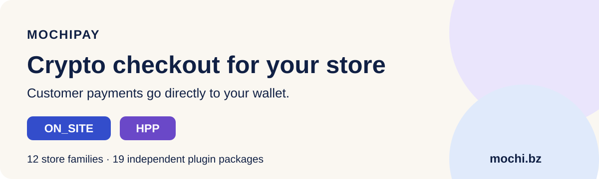

# MochiPay payment plugins

**Add cryptocurrency checkout to your store. Customer payments go directly to
your receiving wallet.**

MochiPay connects ecommerce stores to crypto payment requests, payment monitoring
and verified order updates. Choose **ON_SITE** for a payment popup on your store
or **HPP** for the MochiPay hosted payment page.

[Get started](https://mochi.bz/GettingStarted.aspx) ·
[Choose your plugin](docs/DOWNLOADS.md) ·
[Try the checkout demo](https://mochi.bz/CheckoutDemo.aspx) ·
[View pricing](https://mochi.bz/Pricing.aspx) ·
[API guide](https://mochi.bz/GuideAPI.aspx)

## Store integrations

WooCommerce, OpenCart, Zen Cart, Magento / OpenMage, PrestaShop, Shopware, Drupal Commerce, EC-CUBE, Bagisto, Sylius, osCommerce and thirty bees.

**12 store families · 19 independent packages.** Platform branches stay separate
so you can choose the right installation layout and PHP environment.

| Store family | Package branches |
|---|---|
| WooCommerce | Classic Checkout, Checkout Blocks and HPOS |
| OpenCart | 2.0–2.2, 2.3, 3 and 4 |
| Zen Cart | 1.5.3–1.5.7 and 1.5.8–2.2 |
| Magento / OpenMage | Magento 1 / OpenMage and Magento 2 |
| PrestaShop | 1.6 and 1.7 / 8 / 9 |
| Shopware | 6.6 and 6.7 |
| Drupal Commerce | Supported Drupal 9 / 10 / 11 and Commerce branches |
| EC-CUBE | 4.3 |
| Bagisto | 2.3 |
| Sylius | 2.0 |
| osCommerce | 4.14 |
| thirty bees | 1.6 |

See [all packages and PHP ranges](docs/DOWNLOADS.md) before installing. Modern
platforms may require PHP 8; legacy branches have their own PHP requirements.
This publication is not an official certification by any shopping platform.

## Two checkout modes

| ON_SITE | HPP |
|---|---|
| Payment popup on the store's own domain | Redirect to MochiPay's hosted payment page |
| Shows network, exact amount, address, QR and payment status | Uses the hosted checkout and returns to the store |
| Default mode in these plugins | Available in the same gateway settings |

Buyer payment interfaces offer English (default), Chinese, Spanish, Brazilian
Portuguese, French and German through a manual selector. Merchant settings and
installation instructions remain English. Both modes require server-side
payment verification; a browser return or a callback body alone is not proof
of payment.

## Start accepting payments

1. Create a [MochiPay account](https://mochi.bz/Register.aspx), activate a
   subscription and configure an active receiving wallet for each method offered.
2. [Choose the correct plugin](docs/DOWNLOADS.md). Download its ZIP from
   **Releases → Assets**, or from the official guide. Do not upload the entire
   GitHub source archive to your store.
3. Follow the README inside the ZIP. Enter your API key and secret in the store
   settings, enable MochiPay and choose your Unique amount direction preference.
4. Complete any native payment/delivery/channel setup. Test ON_SITE, HPP and a
   real verified payment in staging before enabling live checkout.

MochiPay URL `https://mochi.bz`, ON_SITE, UP and all five payment choices are
prefilled. Enable only choices with matching active receiving wallets. Existing
saved settings take priority during an update.

## Supported assets and networks

| Asset | Network |
|---|---|
| USDT | TRON / TRC20 |
| USDC | Ethereum / ERC20 |
| BTC | Bitcoin |
| ETH | Ethereum |
| SOL | Solana |

Orders can use the supported native store currency while the buyer pays the
displayed cryptocurrency amount. Exact native-currency limitations remain
platform-specific, including JPY for this EC-CUBE package. Send the exact
displayed amount on the correct network; the QR contains the address only.

## Free plugin code; subscription service

The plugins are distributed under the [package-specific licenses](LICENSE.md).
They connect to the hosted MochiPay service, which requires an active merchant
subscription. Publishing the plugins does not publish the payment server,
monitoring service or merchant database.

## Current publication

Revision **2026.10.07-publication.1** organizes the existing plugins for public distribution.
Payment code and frontend assets remain byte-identical to the current website
packages. The two Shopware Composer support links now point to the correct guide. Existing merchants do not need to reinstall for this revision.
See [changes](CHANGELOG.md) and [validation scope](docs/VALIDATION.md).

Newer adapters still require staging acceptance in a complete running store.
The checkout demo is a simulation, not evidence of a live payment.

## Help and contribution

- [Setup and troubleshooting](docs/SETUP.md)
- [MochiPay FAQ](https://mochi.bz/FAQ.aspx)
- [Community](https://mochi.bz/Community.aspx)
- Report reproducible plugin problems in this repository's **Issues** tab.
- Read [CONTRIBUTING.md](CONTRIBUTING.md) before submitting code, and
  [SECURITY.md](SECURITY.md) for private reports. Never post API secrets,
  wallet recovery material or buyer details in public issues.

Maintained by **MochiPay** · https://mochi.bz
